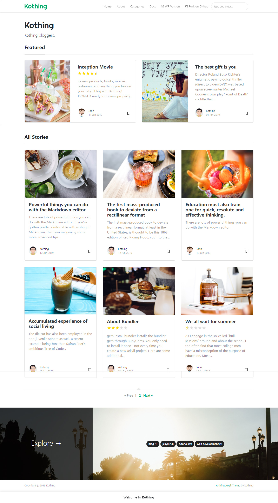

# kothing - Jekyll Theme

[Live Demo](https://kothing.github.io/) &nbsp; | &nbsp; [Download](https://github.com/kothing/kothing-theme/archive/master.zip)

### Copyright

Copyright (C) 2019 Kothing, https://www.kothing.com

**Kothing for Jekyll** is designed and developed by [Kothing](https://www.kothing.com) and it is *free* under MIT license. 

### Contribute

1. [Fork the repo](https://github.com/kothing/kothing-theme).
2. Clone a copy of your fork on your local
3. Create a branch off of master and give it a meaningful name (e.g. my-new-kothing-feature).
4. Make necessary changes, commit, push and open a pull request on GitHub.

Thank you!
